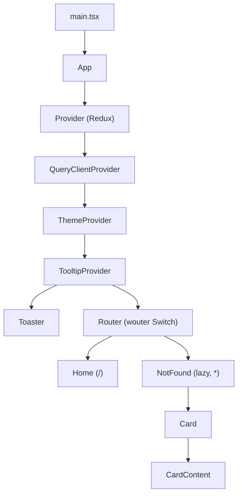
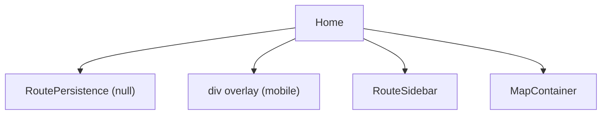
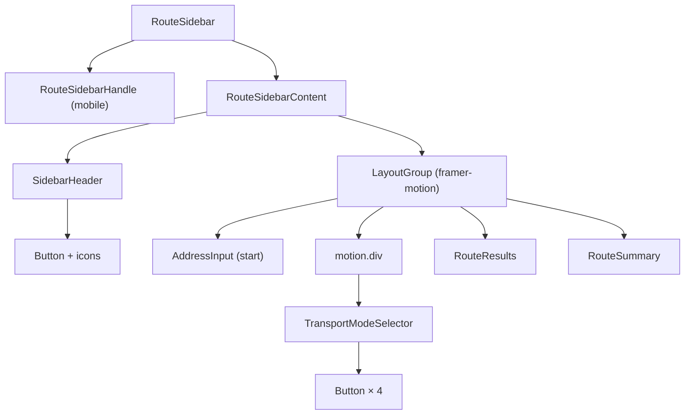
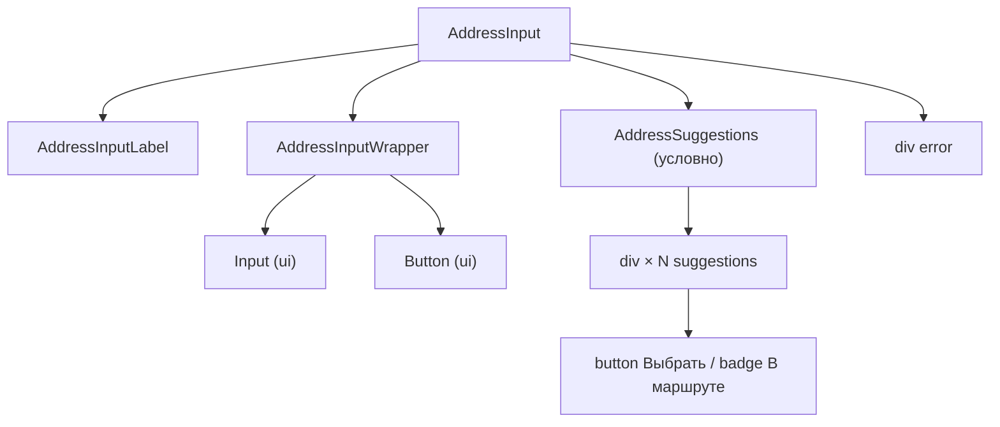
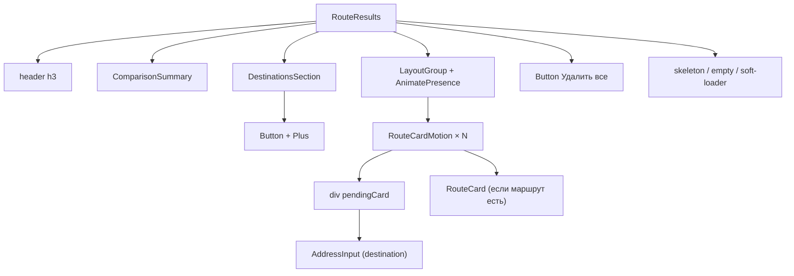
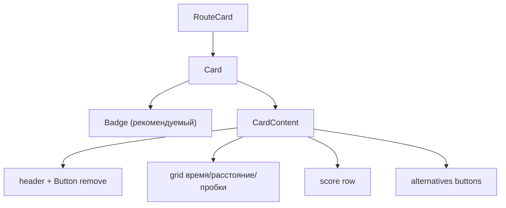
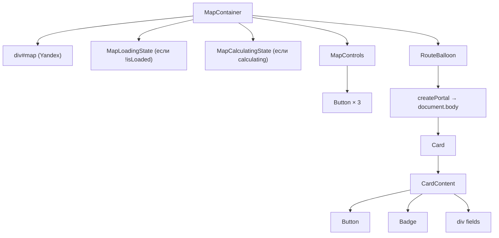
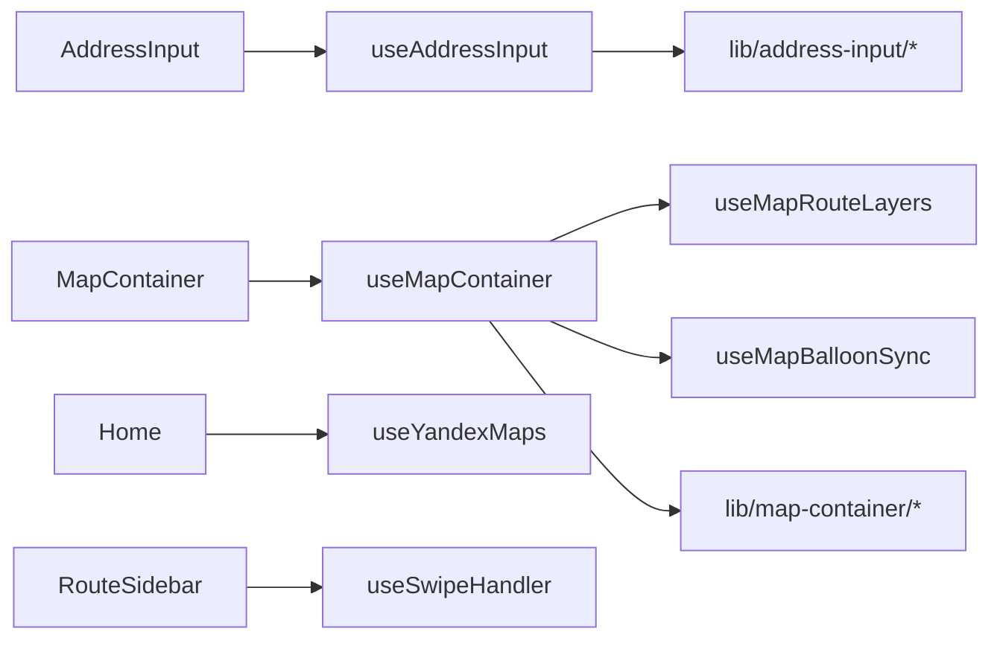

# Дерево вложенности компонентов routeflow

Дерево построено по **фактическим JSX-импортам** в `client/src`. Хуки (`useAddressInput`, `useMapContainer` и др.) не являются компонентами — показаны отдельно как слой логики.

> **Автообновление:** ASCII-дерево и список orphan-компонентов (разделы 5 и 7) пересобираются скриптом. Запуск: `npm run docs:component-tree` из папки `client/`. Подробности — в конце файла.

---

## 1. Корень приложения



| Узел | Файл | Примечание |
|------|------|------------|
| `ThemeProvider` | `client/src/components/theme-provider.tsx` | Только `children`, без UI |
| `RoutePersistence` | `client/src/components/route/route-persistence.tsx` | `return null` — логика localStorage |
| `Toaster` | `client/src/components/ui/toaster.tsx` | Глобальные тосты |

---

## 2. Страница Home — layout



Файл: `client/src/pages/home.tsx`

---

## 3. Сайдбар (RouteSidebar)



### 3.1 AddressInput (начальная точка и пункты)



Файлы: `client/src/components/address/address-input.tsx`, `client/src/components/address/address-suggestions.tsx`

**Хук:** `useAddressInput` — Redux, геокодинг, клавиатура, batch business.

### 3.2 RouteResults (два режима: пусто / с маршрутами)



**RouteCard** → `client/src/components/route/route-card.tsx`:



**ComparisonSummary** и **RouteSummary** — только разметка + CSS, без дочерних feature-компонентов.

**TransportModeSelector** — 4× `Button` (lucide icons).

---

## 4. Карта (MapContainer)



Файл: `client/src/components/map/map-container.tsx`

**Хуки (не в DOM):**

| Хук | Роль |
|-----|------|
| `useMapContainer` | init карты, маркеры, zoom, расчёт маршрутов |
| `useMapRouteLayers` | стили линий, overlays, active route |
| `useMapBalloonSync` | Redux ↔ balloon position/data |

---

## 5. Полное дерево (ASCII, из кода)

<!-- component-tree:ascii:start -->

_Сгенерировано: 2026-05-29T09:18:38.772Z_

```
main.tsx (entry)
└── App
    ├── Router
    │   ├── Home
    │   │   ├── MapContainer
    │   │   │   ├── MapCalculatingState
    │   │   │   ├── MapControls
    │   │   │   │   └── Button
    │   │   │   ├── MapLoadingState
    │   │   │   └── RouteBalloon
    │   │   │       ├── Badge
    │   │   │       ├── Button
    │   │   │       ├── Card
    │   │   │       └── CardContent
    │   │   ├── RoutePersistence
    │   │   └── RouteSidebar
    │   │       ├── RouteSidebarContent
    │   │       │   ├── AddressInput
    │   │       │   │   ├── AddressInputLabel
    │   │       │   │   ├── AddressInputWrapper
    │   │       │   │   │   ├── Button
    │   │       │   │   │   └── Input
    │   │       │   │   └── AddressSuggestions
    │   │       │   ├── RouteResults
    │   │       │   │   ├── AddressInput
    │   │       │   │   │   ├── AddressInputLabel
    │   │       │   │   │   ├── AddressInputWrapper
    │   │       │   │   │   │   ├── Button
    │   │       │   │   │   │   └── Input
    │   │       │   │   │   └── AddressSuggestions
    │   │       │   │   ├── Button
    │   │       │   │   ├── ComparisonSummary
    │   │       │   │   ├── DestinationsSection
    │   │       │   │   │   └── Button
    │   │       │   │   ├── RouteCard
    │   │       │   │   │   ├── Badge
    │   │       │   │   │   ├── Button
    │   │       │   │   │   ├── Card
    │   │       │   │   │   └── CardContent
    │   │       │   │   └── RouteCardMotion
    │   │       │   ├── RouteSummary
    │   │       │   ├── SidebarHeader
    │   │       │   │   └── Button
    │   │       │   └── TransportModeSelector
    │   │       │       └── Button
    │   │       └── RouteSidebarHandle
    │   └── NotFound
    │       ├── Card
    │       └── CardContent
    ├── ThemeProvider
    ├── Toaster
    │   ├── Toast
    │   ├── ToastClose
    │   ├── ToastDescription
    │   ├── ToastProvider
    │   ├── ToastTitle
    │   └── ToastViewport
    └── TooltipProvider
```

<!-- component-tree:ascii:end -->

---

## 6. UI-примитивы (shadcn), реально используемые в feature-коде

| Примитив | Где используется |
|----------|------------------|
| `Button` | SidebarHeader, TransportModeSelector, DestinationsSection, RouteResults, RouteCard, MapControls, AddressInputWrapper, RouteBalloon |
| `Input` | AddressInputWrapper |
| `Card` / `CardContent` | RouteCard, RouteBalloon, NotFound |
| `Badge` | RouteCard, RouteBalloon |
| `Toaster` / `Toast` | App (через `use-toast`) |
| `TooltipProvider` | App |

Остальные ~50 файлов в `client/src/components/ui/` — библиотека shadcn, **не подключены** к основному UI приложения.

---

## 7. Не в дереве (legacy / orphan)

<!-- component-tree:orphans:start -->

**Feature / pages (3)** — не достижимы из `main.tsx`:

- `client/src/components/map-container.tsx`
- `client/src/components/route-balloon.tsx`
- `client/src/components/route/persist-routes-toggle.tsx`

**UI library (40)** — shadcn-файлы, не импортированные в активное дерево:

- `client/src/components/ui/accordion.tsx`
- `client/src/components/ui/alert-dialog.tsx`
- `client/src/components/ui/alert.tsx`
- `client/src/components/ui/aspect-ratio.tsx`
- `client/src/components/ui/avatar.tsx`
- _…и ещё 35 файлов в `client/src/components/ui/`_

<!-- component-tree:orphans:end -->

| Файл | Статус |
|------|--------|
| `client/src/components/map-container.tsx` | Дубликат (проверить скриптом) |
| `client/src/components/route-balloon.tsx` | Дубликат (проверить скриптом) |
| `client/src/components/route/persist-routes-toggle.tsx` | Orphan (проверить скриптом) |

---

## 8. Слой хуков (параллельно компонентам)



---

## Итог

- **~25 feature-компонентов** в активном дереве (без `ui/*` библиотеки).
- **2 точки входа страниц:** `Home`, `NotFound`.
- **Глубина:** до 6–7 уровней (App → Home → RouteResults → RouteCardMotion → RouteCard → Card → CardContent).
- **Портал:** `RouteBalloon` монтируется в `document.body`, визуально вне `MapContainer`, логически — дочерний `MapContainer`.

---

## Автообновление дерева

Да — дерево можно держать актуальным автоматически:

1. **Скрипт** `scripts/generate-component-tree.mjs` обходит `client/src`, строит граф JSX-импортов от `main.tsx` и перезаписывает блоки `component-tree:ascii` и `component-tree:orphans` в этом файле.
2. **Команда:** из `client/` — `npm run docs:component-tree`.
3. **CI (опционально):** добавить шаг в pipeline, который падает, если после генерации есть `git diff` в `COMPONENT_TREE.md` — так дерево не устареет незамеченным.

Ограничения генератора:

- Учитываются только **импорты React-компонентов** из `.tsx` (локальные и `@/`).
- **Условный рендер** (`mobile && …`) в ASCII не отражается — в дереве показаны все возможные дочерние компоненты файла.
- **Порталы** (`createPortal`) помечаются вручную в mermaid-схемах; скрипт видит только JSX внутри файла.
- **Хуки** не входят в DOM-дерево; их связи описаны в разделе 8.

После крупного рефакторинга компонентов: запустите `npm run docs:component-tree` и при необходимости обновите mermaid-схемы в разделах 1–4 вручную.
